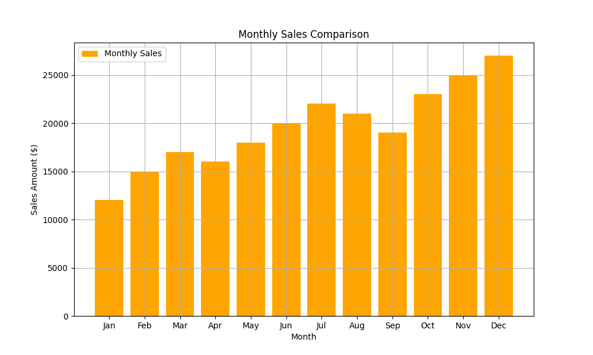

# Hello developers! Welcome to Project 3: Monthly Sales Visualization! ✍️📊

Chef has just opened a new restaurant chain and wants to track how the business is performing throughout the year 🍽️

He has the raw sales numbers for every month, but a list of numbers is hard to read. He needs **you** to build a visualization tool that converts this data into clear **charts** and **graphs**.

---

Your task is to use the **Matplotlib** library to generate:

1. **A Line Chart** to show the growth trend.
2. **A Bar Chart** to compare months side-by-side.

---

## Important Notes

- **Do NOT use** `plt.show()`: This project runs in a "headless" environment (no screen). You must use `plt.savefig("filename.png")` to generate output.
- **Do NOT close the plot after saving**: Do not call `plt.close()` or similar functions after saving the plot.
- **Do NOT change function names**: The testing system relies on them.

## Dataset

You will need to manually enter this data inside the `load_sales_data()` function:

- **Months**: `Jan, Feb, Mar, Apr, May, Jun, Jul, Aug, Sep, Oct, Nov, Dec`
- **Sales ($)**: `12000, 15000, 17000, 16000, 18000, 20000, 22000, 21000, 19000, 23000, 25000, 27000`

---

## Your Tasks

Open `main.py` and complete the logic inside the functions.

1. Load Monthly Sales Data

   Inside `load_sales_data()`:
   - Create a list of strings for the **12 months**.
   - Create a list of integers for the **12 sales values**.
   - **Return** both lists so they can be used by the plotting functions.

2. Visualize Sales Trend (Line Chart)

   Inside `plot_sales_trend(months, sales)`:
   - Set the figure size to **(10, 6)**.
   - Plot a **Line Chart** with:
     - Color: **Blue** (`'b'`)
     - Marker: **Circle** (`'o'`)
     - Line Style: **Solid** (`'-'`)
     - Line Width: **2**
     - Label: **`"Monthly Sales"`** (Required for the legend)
   - Add the title: **`"Monthly Sales Trend (2025)"`**
   - Add labels: X-axis = **`"Month"`**, Y-axis = **`"Sales Amount ($)"`**
   - Enable the **Grid** and show the **Legend**.
   - Save the plot as **`sales_trend.png`** using `plt.savefig()`.

   Docs: `plt.figure()`, `plt.plot()`, `plt.title()`, `plt.xlabel()`, `plt.ylabel()`, `plt.grid()`, `plt.legend()`, `plt.savefig()`

3. Compare Monthly Sales (Bar Chart)

   Inside `plot_sales_bar_chart(months, sales)`:
   - Set the figure size to **(10, 6)**.
   - Plot a **Bar Chart** with:
     - Color: **Orange**
     - Label: **`"Monthly Sales"`** (Required for the legend)
   - Add the title: **`"Monthly Sales Comparison"`**
   - Add labels: X-axis = **`"Month"`**, Y-axis = **`"Sales Amount ($)"`**
   - Enable the **Grid** and show the **Legend**.
   - Save the plot as **`sales_bar_chart.png`** using `plt.savefig()`.

   Docs: `plt.figure()`, `plt.bar()`, `plt.title()`, `plt.xlabel()`, `plt.ylabel()`, `plt.grid()`, `plt.legend()`, `plt.savefig()`

---

## Expected Output

When you run the code, your program should print the following messages and generate two image files in the same directory:

1. Console Output:

```
Monthly Sales Visualization Project

Chart saved: sales_trend.png
Chart saved: sales_bar_chart.png
```

2. Generated Files:

- `sales_trend.png`

  

- `sales_bar_chart.png`

  

---

Good luck! ✅