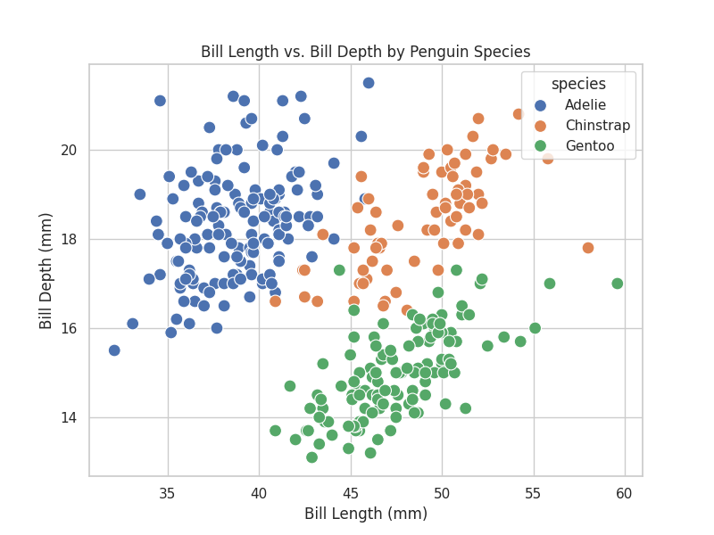

Hello developers! Welcome to Project 4: Penguin Species Explorer! 🐧🧊

Chef has joined a wildlife research team! 🧊 They have collected data on three different penguin species: Adelie, Chinstrap, and Gentoo. Chef wants to understand how these species differ physically, specifically:

1. Do different species have distinct beak (bill) shapes?
2. Which species is the heaviest?

Your task is to use the Seaborn library to create statistical visualizations that answer these questions.

---

Important Notes

- Do NOT use plt.show(): This project runs in a "headless" environment (no screen). You must use plt.savefig("filename.png") to generate output.
- Do NOT close the plot after saving: Do not call plt.close() or similar functions after saving the plot.
- Do NOT change function names: The testing system relies on them.

Dataset

- You do NOT need to download a file. You will load the dataset directly using Seaborn.
- Dataset Name: "penguins"
- The dataset contains these key columns:
  - species: The type of penguin (Adelie, Chinstrap, Gentoo).
  - bill_length_mm: Length of the beak.
  - bill_depth_mm: Depth (height) of the beak.
  - body_mass_g: Weight of the penguin in grams.

---

Your Tasks

Open main.py and complete the missing logic (marked with TODO and _______ ).

1. Setup & Load Data

- Theme: Set the Seaborn theme to "whitegrid" at the top of the file. This makes the plots look professional with a background grid.
- Load: Inside load_data(), load the "penguins" dataset.
- Clean: Drop rows with missing values using .dropna().
- Print: Complete the print statement to display only these columns: ["species", "bill_length_mm", "bill_depth_mm", "body_mass_g"].
- Docs: sns.set_theme() function, sns.load_dataset("name")

2. Scatter Plot: Bill Dimensions
Inside plot_bill_comparison(df):

- Set the figure size to 8 inches × 6 inches.
- Create a Scatter Plot to see if species cluster together based on bill shape:
  - X-axis: bill_length_mm
  - Y-axis: bill_depth_mm
  - Hue: species (Colors points based on species)
  - Palette: "deep"
  - Size: s=100 (Makes points larger)
- Add the title: "Bill Length vs. Bill Depth by Penguin Species".
- Save the plot as bill_comparison.png.
- Docs: sns.scatterplot(data=df, x=..., y=..., hue=...)

3. Box Plot: Body Mass
Inside plot_body_mass_distribution(df):

- Set the figure size to 8 inches × 6 inches.
- Create a Box Plot to compare the weight range of each species:
  - X-axis: species
  - Y-axis: body_mass_g
  - Hue: species (Required to apply palette)
  - Palette: "Set2"
  - Legend: Set legend=False since the X-axis already clearly labels each species.
- Add the title: "Body Mass Distribution by Penguin Species".
- Save the plot as body_mass_distribution.png.
- Docs: sns.boxplot(data=df, x=..., y=..., hue=...)

---

Expected Output:

When you run the code, your program should print the following messages and generate two image files in the same directory:

1. Console Output:

```
Penguin Species Explorer Project

Dataset loaded and cleaned successfully!

Sample Data (first 5 rows):
     species  bill_length_mm  bill_depth_mm  body_mass_g
0    Adelie            39.1           18.7       3750.0
1    Adelie            39.5           17.4       3800.0
2    Adelie            40.3           18.0       3250.0
4    Adelie            36.7           19.3       3450.0
5    Adelie            39.3           20.6       3650.0
Scatter plot saved as: bill_comparison.png
Box plot saved as: body_mass_distribution.png
```

2. Generated Files:

- `bill_comparison.png`



- `body_mass_distribution.png`


